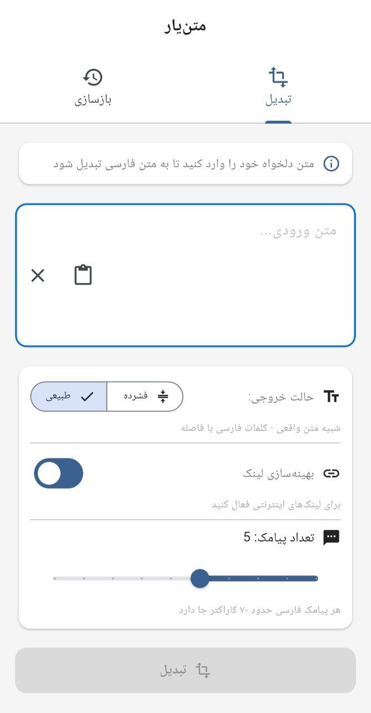
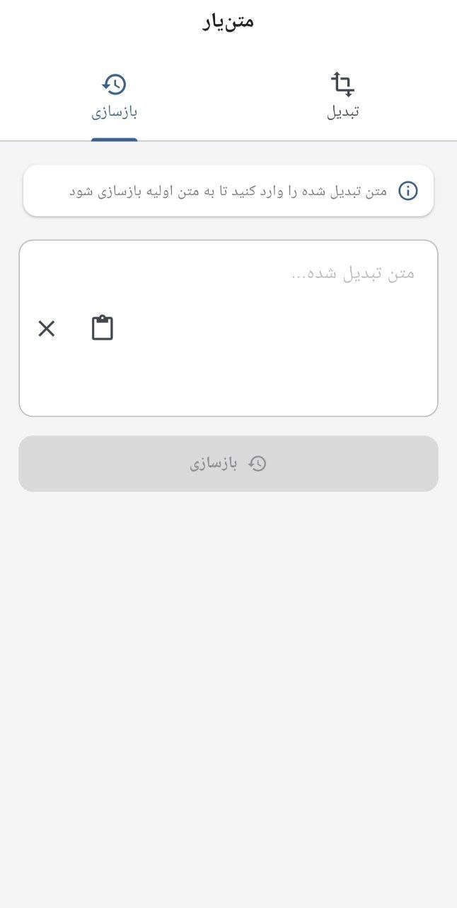

# متن‌یار

ابزار آموزشی تبدیل متن به نمایش فارسی

## اسکرین‌شات

<p align="center">
  
  
</p>

## درباره پروژه

متن‌یار یک پروژه آموزشی برای یادگیری مفاهیم پایه‌ای پردازش متن در Flutter است. این برنامه نشان می‌دهد چگونه می‌توان متن را به نمایش‌های مختلف تبدیل کرد.

## اهداف آموزشی

- آشنایی با encoding و decoding در Dart
- کار با کتابخانه zlib برای فشرده‌سازی
- پیاده‌سازی الگوریتم‌های رمزنگاری متقارن (AES)
- طراحی رابط کاربری فارسی در Flutter
- مدیریت state در برنامه‌های Flutter
- کار با Clipboard API

## ویژگی‌های فنی

- 📴 **کاملاً آفلاین** - بدون نیاز به اینترنت یا سرور
- 🔄 **تبدیل دوطرفه** - encode و decode (Reversible Mapping)
- 📝 **سه حالت نمایش** - فشرده، طبیعی و رمزدار
- 📋 **کپی و پیست** - رابط ساده
- 🌙 **تم سیستم** - روشن و تاریک

## حالت‌های تبدیل

| حالت | توضیح | کاربرد آموزشی |
|------|-------|---------------|
| فشرده | نگاشت به ۱۶ حرف فارسی | یادگیری nibble encoding |
| طبیعی | نگاشت به ۲۵۶ کلمه فارسی | یادگیری byte-to-word mapping |
| رمزدار | رمزنگاری AES-CBC با رمز عبور | یادگیری رمزنگاری متقارن |

## نصب و اجرا

```bash
flutter pub get
flutter run
```

## ساختار پروژه

```
lib/
├── main.dart              # نقطه ورود
├── screens/
│   └── home_screen.dart   # صفحه اصلی
└── core/
    └── converter/
        └── text_converter.dart  # منطق تبدیل
```

## نحوه کار کلی

این پروژه یک فرایند ساده‌ی تبدیل و بازسازی متن را پیاده‌سازی می‌کند:

1. **فشرده‌سازی** - استفاده از zlib برای کاهش حجم
2. **رمزنگاری** (اختیاری) - AES-CBC با کلید مشتق از رمز عبور
3. **نگاشت** - تبدیل بایت‌ها به کاراکترها یا کلمات فارسی

جزئیات پیاده‌سازی در کد قابل مشاهده است.

## محدودیت‌ها

- این پروژه صرفاً آموزشی است
- خروجی معمولاً طولانی‌تر از متن ورودی است
- رمزنگاری پیاده‌سازی شده برای اهداف آموزشی است و برای داده‌های حساس توصیه نمی‌شود
- برای استفاده در سناریوهای عملی طراحی نشده است

## منابع یادگیری

- [Dart Codec Documentation](https://api.dart.dev/stable/dart-convert/dart-convert-library.html)
- [Flutter Internationalization](https://docs.flutter.dev/ui/accessibility-and-internationalization/internationalization)
- [ZLib Compression](https://api.dart.dev/stable/dart-io/ZLibCodec-class.html)
- [AES Encryption](https://en.wikipedia.org/wiki/Advanced_Encryption_Standard)

## مشارکت

Pull Request و Fork آزاد است.
از ایده‌های جایگزین برای نگاشت استقبال می‌شود.

## مجوز

MIT License - استفاده آزاد برای اهداف آموزشی
